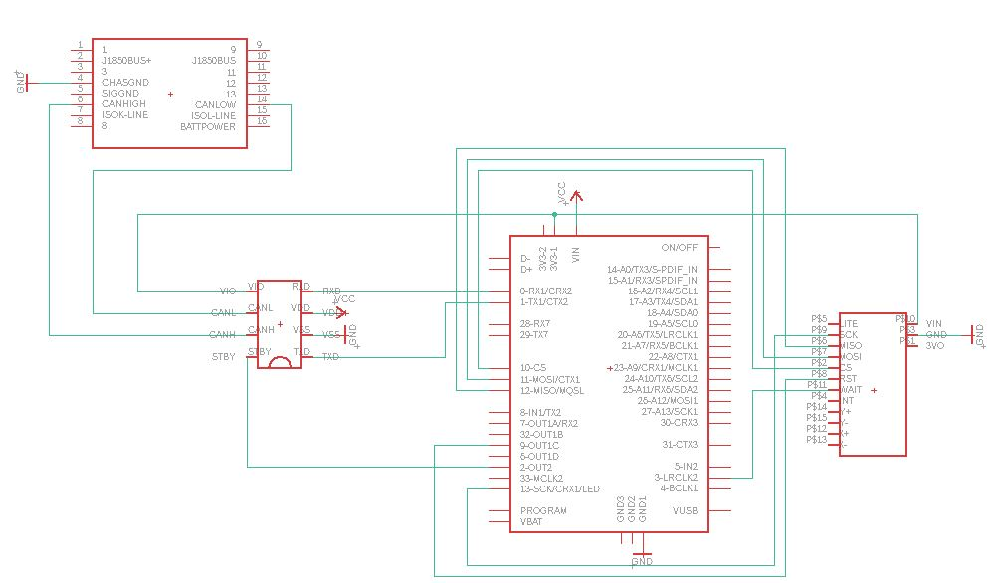
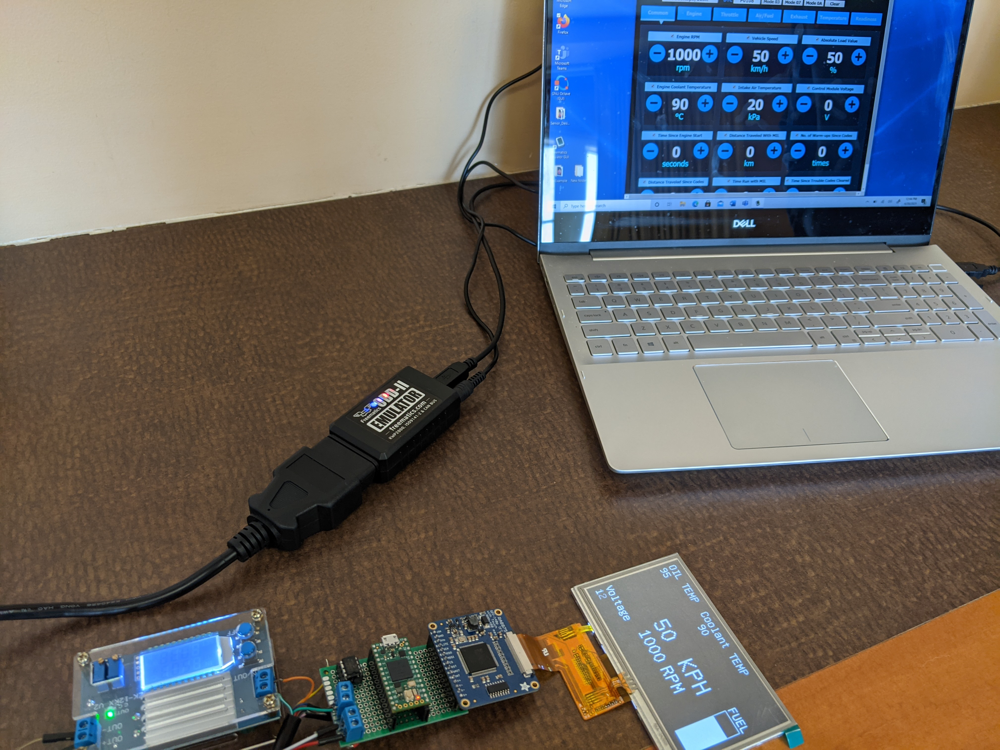

# Senior_Design
Creating an OBD-II heads up display utilizing CAN protocol
  
Developers: Zach Schmitz, Dillon Mahr, Daniel Folden, & Trevor Washinsky

## CAN transceiver 
Using the [MCP2562FD](https://www.microchip.com/wwwproducts/en/MCP2562FD) CAN transceiver with onboard Teensy 4.0 CAN controller to interface with 

## Display
Implementing Adafruit [RA8875](https://www.adafruit.com/product/1590) driver board to display to a [480x272 display](https://www.adafruit.com/product/1591).

## Emulator 
Using the [freematics OBD-II emulator](https://freematics.com/pages/products/freematics-obd-emulator-mk2/).

### Photos

This diagram outlines the connections we are making. This excludes our power supply which steps down 12V to 5V which is used to supply the CAN transceiver and Teensy 4.0

This overhead view of the system shows the power from the power supply and the CANH/CANL bus connecting on the left. The transceiver is close to the Teensy 4.0 on the top left while the RA8875 driver board is connected on the right.

This is the configuration of the display. It shows many diagnostics such as speed, rpm, and oil temperature. With a fuel gauge on the right hand side.

Our system as a whole with OBD-II emulator plugged into a wall socket and computer for programming.

